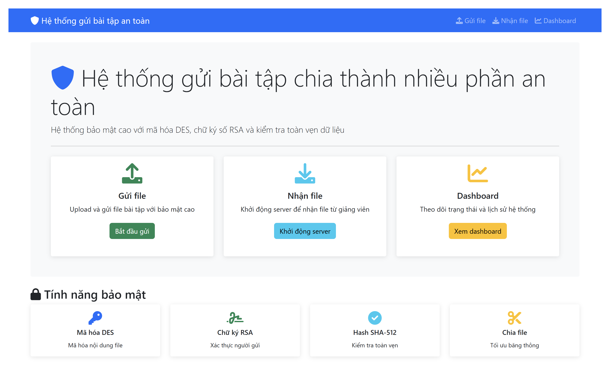
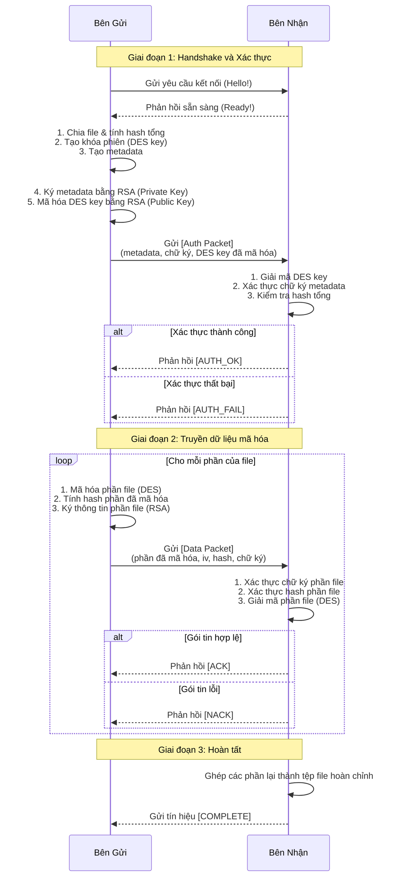
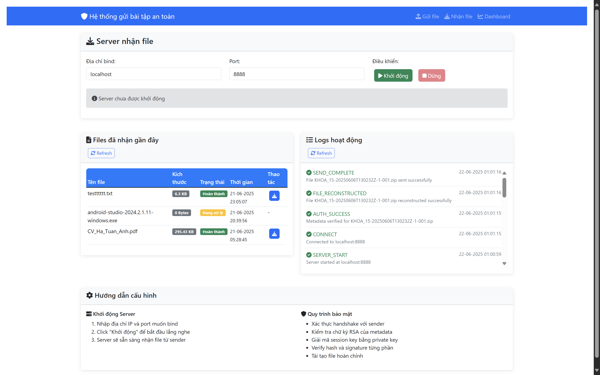
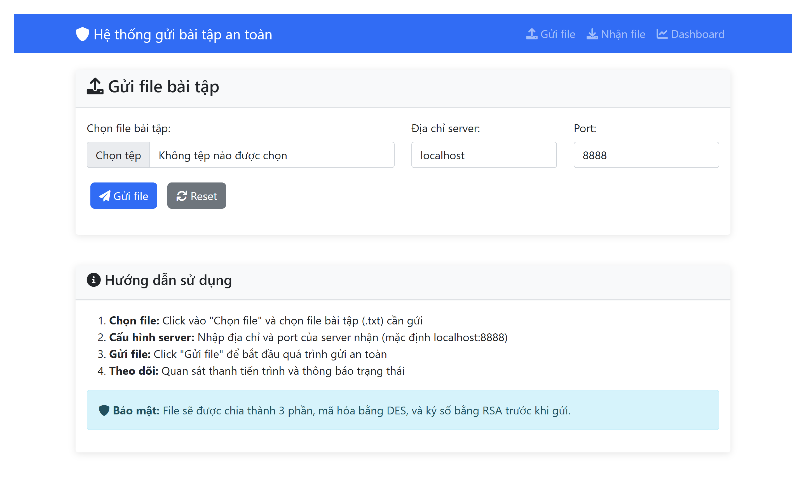
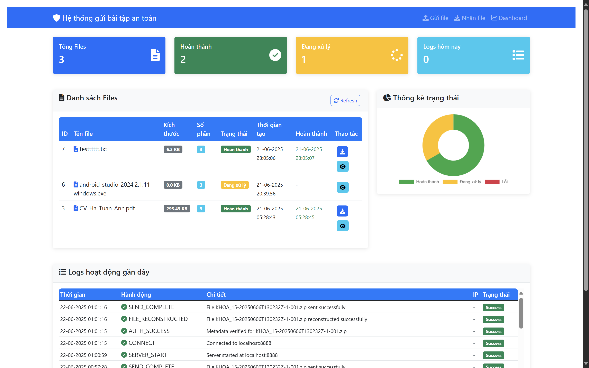

# 🛡️ Hệ thống Gửi và Nhận Bài tập An toàn Chia Nhiều Phần 🚀

## 1. 📝 Giới thiệu (Introduction)

**Secure Assignment System** là một dự án phần mềm mô phỏng quy trình gửi và nhận tệp tin (ví dụ: bài tập, tài liệu quan trọng,...) một cách an toàn qua mạng. Dự án được xây dựng như **một phần của học phần An toàn và Bảo mật Thông tin**, với mục tiêu vận dụng kiến thức lý thuyết vào một hệ thống thực tế.

### 🎯 **Vấn đề cần giải quyết:**
Hệ thống giải quyết vấn đề bảo mật trong quá trình truyền dữ liệu bằng cách áp dụng các kỹ thuật mã hóa mạnh để đảm bảo chỉ người nhận hợp lệ mới có thể đọc nội dung, đồng thời giữ nguyên vẹn dữ liệu trong quá trình truyền tải.

### 🏫 **Ứng dụng thực tế:**
- **Giáo dục:** Gửi bài tập, đề thi, tài liệu học tập an toàn.
- **Doanh nghiệp:** Truyền tài liệu mật, hợp đồng, báo cáo quan trọng.
- **Cá nhân:** Chia sẻ tệp riêng tư giữa các thành viên
- **Nghiên cứu:** Bảo vệ dữ liệu nghiên cứu quan trọng

### 👥 **Đối tượng sử dụng:**
- **Sinh viên:** Học tập, tham khảo và thực hành về An toàn, bảo mật thông tin.
- **Giảng viên:** Hỗ trợ giảng dạy hoặc mô phỏng minh họa.
- **Nhà phát triển:** Tham khảo thiết kế và kiến trúc hệ thống.
- **Người dùng cuối:** Ứng dụng cho các nhu cầu trao đổi riêng tư.

### 🚀 **Lợi ích nổi bật:**
- **🔒 Bảo mật cao:** Mã hóa end-to-end với thuật toán mạnh.
- **⚡ Dễ sử dụng:** Giao diện web trực quan, thao tác đơn giản và thân thiện
- **📊 Theo dõi minh bạch:** Dashboard quản lý và logs chi tiết.
- **🔄 Ổn định, linh hoạt và đáng tin cậy:** Cơ chế gửi lại tự động khi có lỗi hoặc gián đoạn.

### 📚 **Kiến thức áp dụng:**
Dự án là sự kết hợp của nhiều khái niệm quan trọng trong lĩnh vực bảo mật, được xây dựng với mục tiêu học hỏi và nghiên cứu về:
-   Mã hóa đối xứng và bất đối xứng (Hybrid Encryption).
-   Chữ ký số để xác thực và đảm bảo tính toàn vẹn.
-   Giao tiếp mạng qua TCP socket.
-   Xây dựng cả giao diện Web (Web App - Flask) và giao diện dòng lệnh (Click - CLI).

### 🖼️ Giao diện tổng quan hệ thống


*Hình ảnh: Giao diện trang chủ của Web App với các tính năng chính*

## 2. 🏗️ Mô tả hệ thống (System Overview)

Hệ thống được xây dựng theo mô hình Client-Server, trong đó Sender (bên gửi) sẽ chia nhỏ tệp tin, mã hóa từng phần và gửi tới Receiver (bên nhận). Receiver sẽ xác thực, giải mã và ghép các phần lại để khôi phục thành tệp gốc.

### 🎯 **Mục tiêu chính:**
- **Bảo mật:** Đảm bảo dữ liệu được truyền đi một cách an toàn qua mạng
- **Toàn vẹn:** Phát hiện và ngăn chặn mọi sự thay đổi trái phép.
- **Xác thực:** Xác minh danh tính người gửi
- **Hiệu quả:** Tối ưu hóa tốc độ và hiệu suất truyền tải.

### 🔐 **Cơ chế bảo mật cốt lõi – Hybrid Encryption (Mã hóa lai):**

1.  **Mã hóa nội dung (DES):** Nội dung tệp tin được mã hóa bằng thuật toán đối xứng DES cùng một *khóa phiên (session key)* ngẫu nhiên. Cách này giúp xử lý khối lượng dữ liệu lớn một cách hiệu quả và nhanh chóng.
2.  **Mã hóa khóa phiên (RSA):** *Khóa phiên*  sau đó được mã hóa bằng *khóa công khai (public key)* của bên nhận thông qua thuật toán bất đối xứng RSA. Điều này đảm bảo chỉ bên nhận (người sở hữu *khóa riêng tư - private key* tương ứng) mới có thể giải mã được khóa phiên này.
3.  **Chữ ký số (RSA + SHA-512):** Toàn bộ siêu dữ liệu (metadata) và từng phần của tệp tin đều được ký bằng *khóa riêng tư* của bên gửi. Bên nhận sẽ dùng *khóa công khai* của bên gửi để xác minh chữ ký, đảm bảo rằng dữ liệu không bị chỉnh sửa (toàn vẹn) và đúng nguồn gốc (xác thực).

### 📊 Sơ đồ luồng hoạt động



## 3. ✨ Tính năng chính (Features)

### 🔐 **Bảo mật nâng cao:**
-   🔒 **Mã hóa End-to-End:** Dữ liệu được mã hóa từ lúc gửi cho đến lúc nhận, bảo vệ khỏi các cuộc tấn công nghe lén (eavesdropping).
-   🛡️ **Đảm bảo tính toàn vẹn:** Sử dụng hash SHA-512 và chữ ký số RSA để phát hiện bất kỳ thay đổi nào đối với dữ liệu.
-   ✍️ **Xác thực người gửi:** Chữ ký số khẳng định danh tính của người gửi, chống giả mạo.
-   📦 **Chia nhỏ tệp tin:** Tự động chia tệp thành nhiều phần trước khi gửi, giúp quản lý việc truyền tải và tăng tính phức tạp cho việc tấn công.

### 🖥️ **Giao diện người dùng:**
-   🌐 **Giao diện Web hiện đại:** Giao diện web trực quan, dễ sử dụng với dashboard theo dõi trạng thái, lịch sử gửi/nhận và logs hệ thống. Đây là giao diện chính được khuyến nghị sử dụng.
-   📱 **Responsive Design:** Giao diện tương thích với mọi thiết bị (desktop, tablet, mobile).
-   ⌨️ **CLI (Tùy chọn):** Giao diện dòng lệnh cho người dùng chuyên sâu hoặc tự động hóa các tác vụ.

### 📊 **Quản lý và theo dõi:**
-   🗄️ **Lưu trữ và Quản lý:** Sử dụng cơ sở dữ liệu SQLite để lưu trữ lịch sử các phiên giao dịch, trạng thái tệp và logs hoạt động.
-   📥 **Download file:** Tự động tải xuống file đã nhận thành công với tính năng download trực tiếp.
-   📋 **Real-time logs:** Hiển thị logs hoạt động theo thời gian thực, giúp theo dõi quá trình gửi/nhận.

### 🔄 **Độ tin cậy:**
-   🤝 **Cơ chế Handshake và ACK/NACK:** Đảm bảo kết nối ổn định và các gói tin được gửi một cách đáng tin cậy, có cơ chế gửi lại nếu lỗi.
-   ⚡ **Truyền tải hiệu quả:** Tối ưu hóa băng thông và tốc độ truyền tải dữ liệu.

## 4. 💻 Yêu cầu hệ thống (System Requirements)

### 🖥️ **Yêu cầu phần cứng:**
-   **RAM:** Tối thiểu 2GB (khuyến nghị 4GB trở lên)
-   **Ổ cứng:** Ít nhất 100MB dung lượng trống
-   **Mạng:** Kết nối mạng để gửi/nhận file

### 💾 **Yêu cầu phần mềm:**
-   **Hệ điều hành:** Windows 10+, macOS 10.14+, hoặc Linux (Ubuntu 18.04+)
-   **Python:** Phiên bản `3.8` trở lên (khuyến nghị Python 3.9+)
-   **Git:** Để clone repository (tùy chọn)

### 📚 **Thư viện Python:**
Các thư viện chính được liệt kê trong file `requirements.txt`:
-   `Flask` - Web framework
-   `pycryptodome` - Thư viện mã hóa
-   `click` - CLI framework
-   `flask-moment` - Hiển thị thời gian
-   `colorama` - Màu sắc cho terminal
-   `tzdata` - Dữ liệu timezone
-   `requests` - HTTP requests

### 🌐 **Yêu cầu trình duyệt (cho Web App):**
-   **Chrome/Edge:** Phiên bản 80+
-   **Firefox:** Phiên bản 75+
-   **Safari:** Phiên bản 13+
-   **Hỗ trợ JavaScript:** Bắt buộc

### 🔧 **Yêu cầu mạng:**
-   **Port:** 5000 (Web App), 8888 (Receiver Server)
-   **Firewall:** Cần mở port 8888 nếu chạy trên mạng khác
-   **Localhost:** Khuyến nghị chạy trên cùng máy để demo

## 5. ⚙️ Cài đặt (Installation)

Thực hiện các bước sau để cài đặt và chạy dự án:

**Bước 1: Clone repository**
```bash
git clone <URL_CUA_REPOSITORY>
cd secure_assignment_system
```

**Bước 2: Tạo và kích hoạt môi trường ảo**
-   Trên Windows:
    ```bash
    python -m venv venv
    .\venv\Scripts\activate
    ```
-   Trên macOS/Linux:
    ```bash
    python3 -m venv venv
    source venv/bin/activate
    ```

**Bước 3: Cài đặt các thư viện cần thiết**
```bash
pip install -r requirements.txt
```

**Bước 4: Tạo cặp khóa RSA**
Hệ thống cần một cặp khóa RSA (private/public) để hoạt động. Chạy lệnh sau để tạo chúng. Khóa sẽ được lưu trong thư mục `keys/`.
```bash
python cli.py generate-keys
```

## 6. ▶️ Hướng dẫn sử dụng (Usage)

Hệ thống cung cấp hai cách sử dụng, các bạn có thể chạy hệ thống thông qua Web App hoặc CLI. Với **Web App** là giao diện chính được khuyến nghị.

### 🎯 **Quy trình sử dụng hoàn chỉnh:**

1. **Khởi động hệ thống** → 2. **Khởi động server nhận** → 3. **Gửi file** → 4. **Kiểm tra kết quả** → 5. **Tải file về**

### A. 🌐 Chạy bằng Giao diện Web (Web App) - **Khuyến nghị**

#### **Bước 1: Khởi động Web App**
```bash
python web_app.py
```
Mở trình duyệt và truy cập vào `http://127.0.0.1:5000`.

> **✅ Xác nhận:** Các bạn sẽ thấy trang chủ với 3 card chính: Gửi file, Nhận file, Dashboard.

#### **Bước 2: Khởi động Server nhận (Receiver)**
-   Truy cập trang **Receiver** trên giao diện web.
-   Nhấn nút "Start Server". Server sẽ chạy ngầm và sẵn sàng nhận file.

### 📥 Giao diện trang Receiver


*Hình ảnh: Giao diện trang Receiver để khởi động server nhận file*

> **✅ Xác nhận:** Các bạn sẽ thấy thông báo "Server đã khởi động tại localhost:8888"

#### **Bước 3: Gửi File (Sender)**
-   Truy cập trang **Sender**.
-   Chọn file cần gửi (hỗ trợ mọi định dạng).
-   Nhập đúng địa chỉ Host và Port của server nhận (mặc định là `localhost:8888`).
-   Nhấn "Send File".

### 📤 Giao diện trang Sender


*Hình ảnh: Giao diện trang Sender để gửi file*

> **✅ Xác nhận:** Các bạn sẽ thấy thông báo "File đã được gửi thành công!"

#### **Bước 4: Kiểm tra kết quả (Dashboard)**
-   Truy cập trang **Dashboard** để xem danh sách các file đã gửi/nhận và logs hệ thống.
-   Kiểm tra trạng thái file: `pending` → `completed` → `downloaded`

### 📊 Giao diện trang Dashboard


*Hình ảnh: Giao diện trang Dashboard hiển thị lịch sử và logs*

#### **Bước 5: Tải file về**
-   Trong Dashboard, nhấn nút "Download" bên cạnh file đã nhận thành công.
-   File sẽ được tải về thư mục Downloads của các bạn.

### 🚨 **Xử lý lỗi thường gặp:**

**Lỗi 1: "Không thể kết nối tới receiver"**
- Kiểm tra server receiver đã khởi động chưa
- Kiểm tra port 8888 có bị chặn không
- Thử khởi động lại server receiver

**Lỗi 2: "File upload thất bại"**
- Kiểm tra kích thước file (khuyến nghị < 100MB)
- Kiểm tra định dạng file
- Thử file khác để test

**Lỗi 3: "Server đã đang chạy"**
- Vào Dashboard → Logs để xem trạng thái
- Hoặc khởi động lại Web App

### 💡 **Mẹo sử dụng:**

- **📁 File lớn:** Hệ thống tự động chia nhỏ file, không cần lo lắng
- **🔒 Bảo mật:** Mỗi phiên gửi sử dụng khóa mã hóa khác nhau
- **📊 Theo dõi:** Dashboard hiển thị logs real-time
- **🔄 Gửi lại:** Nếu lỗi, hệ thống tự động gửi lại

### B. ⌨️ Chạy bằng Dòng lệnh (CLI) - *Tùy chọn*

> **📝 Lưu ý:** Phần CLI được cung cấp cho người dùng chuyên sâu. Đối với demo và sử dụng thông thường, khuyến nghị sử dụng **Web App** với giao diện trực quan và dễ sử dụng hơn.

**1. Mở hai cửa sổ terminal** và kích hoạt môi trường ảo ở cả hai.

**2. Cửa sổ 1: Chạy Receiver**
```bash
python cli.py receive --host localhost --port 8888
```
Server sẽ khởi động và chờ kết nối.

**3. Cửa sổ 2: Chạy Sender**
```bash
python cli.py send "duong/dan/den/file/cua/ban.txt" --host localhost --port 8888
```
Thay `"duong/dan/den/file/cua/ban.txt"` bằng đường dẫn thực tế đến file các bạn muốn gửi.

> **💡 Lưu ý:** Phần CLI được cung cấp cho người dùng chuyên sâu. Đối với demo và sử dụng thông thường, khuyến nghị sử dụng **Web App** với giao diện trực quan và dễ sử dụng hơn.

## 7. 📸 Demo (Chạy thử)

### 🚀 Demo hoàn chỉnh hệ thống


*GIF: Minh họa toàn bộ quá trình từ trang chủ → khởi động server → gửi file → nhận file → kiểm tra kết quả → tải file về*

## 8. 📂 Cấu trúc thư mục (Project Structure)

```
secure_assignment_system/
├── README.md                     # Tài liệu hướng dẫn dự án
├── LICENSE                       # Giấy phép MIT
├── requirements.txt              # Các thư viện Python cần thiết
├── .gitignore                    # Danh sách file/thư mục bỏ qua khi commit
├── cli.py                        # Giao diện dòng lệnh (CLI)
├── config.py                     # Các biến cấu hình hệ thống
├── crypto_utils.py               # Các hàm xử lý mã hóa, chữ ký số
├── database.py                   # Quản lý và tương tác với DB (SQLite)
├── receiver.py                   # Logic của bên nhận file
├── sender.py                     # Logic của bên gửi file
├── web_app.py                    # Ứng dụng web Flask
├── data/
│   ├── assignment_system.db      # File cơ sở dữ liệu SQLite (tự động tạo)
│   ├── received_files/           # Thư mục chứa các file đã nhận thành công
│   └── uploads/                  # Thư mục tạm chứa file upload từ web
├── images/                       # Thư mục chứa ảnh demo và giao diện
│   ├── homepage.png              # Ảnh trang chủ
│   ├── sender-interface.png      # Ảnh giao diện gửi file
│   ├── receiver-interface.png    # Ảnh giao diện nhận file
│   ├── dashboard-interface.png   # Ảnh giao diện dashboard
│   └── full-demo.gif             # GIF demo hoàn chỉnh hệ thống
├── keys/                         # Thư mục chứa cặp khóa RSA (tự động tạo)
│   ├── private_key.pem           # Khóa riêng tư (tạo bằng cli.py generate-keys)
│   └── public_key.pem            # Khóa công khai (tạo bằng cli.py generate-keys)
├── logs/                         # Thư mục chứa file log (tự động tạo)
├── static/                       # Tài nguyên tĩnh (CSS, JS) cho web app
│   ├── css/
│   │   └── style.css             # File CSS chính cho giao diện web
│   └── js/
│       └── app.js                # File JavaScript chính cho tương tác
└── templates/                    # Các file HTML template cho Flask
    ├── base.html                 # Template cơ sở
    ├── dashboard.html            # Trang dashboard quản lý
    ├── receiver.html             # Trang khởi động server nhận
    └── sender.html               # Trang gửi file
```

## 9. 🛠️ Công nghệ sử dụng (Technologies Used)

-   **Ngôn ngữ:** Python 3
-   **Giao diện Web:**
    -   Flask `3.1.1`
    -   Jinja2 (template engine)
    -   Flask-Moment `1.0.6` (hiển thị thời gian)
-   **Giao diện Dòng lệnh:**
    -   Click `8.2.1`
-   **Mã hóa & Bảo mật:**
    -   PyCryptodome `3.23.0` (RSA, DES, SHA-512, PKCS#1v1.5)
-   **Cơ sở dữ liệu:**
    -   SQLite3 (thông qua thư viện `sqlite3` có sẵn của Python)
-   **Mạng:**
    -   Thư viện `socket` của Python

## 10. 👨‍💻 Tác giả (Author)

Xin chào! Tôi tên là **Hà Tuấn Anh**, sinh viên **Khoa Công nghệ thông tin** của **Trường Đại học Đại Nam**.
Nếu các bạn có bất kỳ câu hỏi, góp ý, hay muốn kết nối, đừng ngần ngại liên hệ với tôi qua:

-   **Họ và tên:** Hà Tuấn Anh
-   **GitHub:** [@tuananh220204](https://github.com/tuananh220204)
-   **Email:** [tuananh22022004@gmail.com](mailto:tuananh22022004@gmail.com)

## 11. 🤝 Đóng góp (Contributing)

Dự án hiện đang được phát triển bởi cá nhân. Tuy vậy, tôi luôn sẵn sàng lắng nghe và đón nhận mọi đóng góp – từ việc báo lỗi (issues), cải tiến tính năng cho đến các pull request.
Nếu các bạn muốn tham gia hoặc có ý tưởng hay, đừng ngần ngại mở một issue để cùng trao đổi trước khi thực hiện các thay đổi lớn nhé!

## 12. 📜 Giấy phép (License)

Dự án này được cấp phép theo **Giấy phép MIT** - một trong những giấy phép mã nguồn mở phổ biến và dễ hiểu nhất hiện nay.

### ⚖️ Những quyền các bạn có theo MIT License:
- ✅ **Tự do sử dụng:** Có thể sử dụng, sao chép, chia sẻ lại dự án cho bất kỳ mục đích nào.
- ✅ **Tự do sửa đổi:** Toàn quyền chỉnh sửa hoặc tạo ra các phiên bản khác.
- ✅ **Thương mại hóa:** Có thể sử dụng dự án cho mục đích thương mại
- ⚠️ **Lưu ý duy nhất:** Phải giữ lại thông tin bản quyền, ghi rõ tên tác giả gốc và giấy phép MIT trong mọi bản phân phối.

### Vì sao chọn MIT License cho dự án này?
- **Đơn giản, rõ ràng:** Dễ hiểu, không ràng buộc phức tạp, dễ tiếp cận.
- **Khuyến khích học tập:** Ai cũng có thể học hỏi và đóng góp.
- **Phù hợp học thuật:** Tối ưu cho dự án mang tính nghiên cứu, giáo dục.
- **Lan tỏa giá trị:** Góp phần xây dựng cộng đồng mã nguồn mở

👉 Chi tiết nội dung giấy phép nằm trong file `LICENSE` trong thư mục gốc để biết đầy đủ nội dung giấy phép.

## 13. 🙏 Cảm ơn (Acknowledgments)

-   Em xin chân thành cảm ơn thầy **TS. Trần Đăng Công** - người đã tận tình hướng dẫn và đồng hành cùng em trong suốt quá trình thực hiện dự án này. Những kiến thức quý báu về An toàn và bảo mật thông tin từ thầy đã giảng dạy trên lớp là nền tảng vững chắc để em hoàn thiện sản phẩm này.
-   Cảm ơn cộng đồng mã nguồn mở – những người đã đóng góp hàng ngàn giờ làm việc để xây dựng các thư viện tuyệt vời mà dự án này được hưởng lợi trực tiếp.
-   Cuối cùng, cảm ơn những bài giảng, tài liệu và chia sẻ trong lĩnh vực An toàn và bảo mật thông tin – nguồn cảm hứng chính để tôi bắt đầu và theo đuổi dự án này.

---
